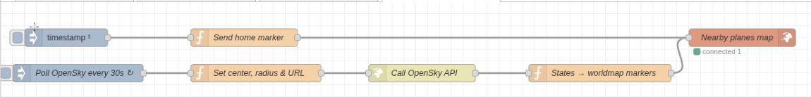
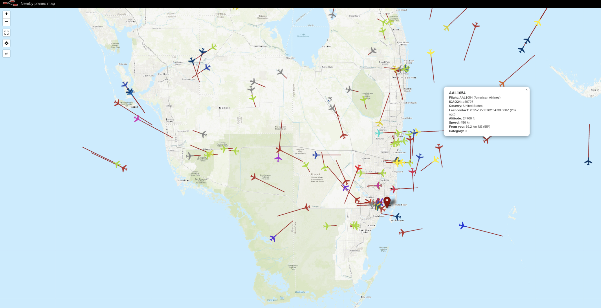

# Node-RED OpenSky Nearby Planes Radar 🌍✈️

A plug-and-play **Node-RED** flow that uses the **OpenSky Network** public REST API to show **live airplanes around any location** on an interactive **worldmap**.

You choose a **center latitude / longitude / radius**, and the flow:

* Polls the OpenSky `/api/states/all` endpoint
* Draws nearby planes on `node-red-node-worldmap`
* Colors planes by **airline**
* Shows **distance & bearing** from your center
* Shows **altitude, speed, and last contact time**

No API key is required for this basic setup.

---

## 1. Features

* ✈️ **Live aircraft** around your chosen city using OpenSky
* 🌎 **Configurable center & radius** (edit 3 values in one function)
* 🎨 **Airline-colored markers** based on callsign (e.g., AAL, DAL, JBU, etc.)
* 🧭 **Distance & bearing** from your “Radar Center”
* 📡 **Altitude (ft)** and **speed (knots)**
* ⏱️ **Last contact age** in seconds
* 🚁 Optional support for **helicopters/other types** if an aircraft DB is added
* 🏠 **Radar Center home icon** so you always see where your search is centered
* 🌐 Uses `node-red-node-worldmap` for a slick, interactive UI

---

## 2. Requirements

Before you import the flow, make sure you have:

* [Node-RED](https://nodered.org/) installed and running
* The `node-red-node-worldmap` node:

  * In Node-RED: **Menu → Manage palette → Install → search `node-red-node-worldmap`**

You’ll also need outbound internet access to:

* `https://opensky-network.org`

---

## 3. Files in This Repo

* **`OpenSky-Planes-WorldMap.json`**
  The exported Node-RED flow containing:

  * Polling
  * OpenSky API call
  * State → worldmap marker transform
  * Worldmap and Radar Center marker

* **`screenshots/nodered-flow-overview.png`**
  
  Screenshot of the Node-RED flow in the editor.

* **`screenshots/worldmap-live-miami-air-traffic.png`**
  
  Screenshot of the worldmap showing live planes around Miami.

* **`LICENSE`**
  MIT license for this project.

---

## 4. Importing the Flow (Step by Step)

1. Open your Node-RED editor in the browser:

   * Usually `http://<your-node-red-host>:1880`

2. Click **Menu (≡) → Import → Clipboard**

3. Open `OpenSky-Planes-WorldMap.json` in a text editor,
   **select all**, and **copy** the JSON.

4. Paste the JSON into the Node-RED Import dialog and click **Import**.

5. You should see a new tab (e.g. `OpenSky Nearby Planes Radar`) with:

   * An Inject node (“Poll OpenSky every 30s”)
   * A function node (“Set center, radius & URL”)
   * HTTP request node
   * Function node (“States → worldmap markers”)
   * Worldmap node (“Nearby planes map”)
   * Inject + function for the Radar Center marker

---

## 5. Setting Your Location (Center & Radius)

This is the **only part a normal user needs to edit**.

1. Double-click the function node named:
   `Set center, radius & URL`

2. At the top of the code, you’ll see a block like:

   ```js
   // ===== DEFAULT DEMO CONFIG (edit these for your city) =====
   const defaultCenterLat = 25.7617;   // Miami latitude (change to your latitude)
   const defaultCenterLon = -80.1918;  // Miami longitude (change to your longitude)
   const defaultRadiusKm  = 200;       // Search radius in km (change if needed)
   // ==========================================================
   ```

3. Change these values:

   * `defaultCenterLat` → your city’s latitude
   * `defaultCenterLon` → your city’s longitude
   * `defaultRadiusKm` → how far out (in km) you want to search for planes

4. Click **Done**.

> 💡 Example: For New York City, you might use:
>
> ```js
> const defaultCenterLat = 40.7128;
> const defaultCenterLon = -74.0060;
> const defaultRadiusKm  = 250;
> ```

---

## 6. Deploying and Viewing the Map

1. Click the red **Deploy** button in the top-right of Node-RED.

2. Find the worldmap node named:

   * `Neaerby planes map`

   It’s configured to serve at the path:
   `/worldmapplanes`

3. Open this URL in your browser:

   ```text
   http://<your-node-red-host>:1880/worldmapplanes
   ```

4. Within a few seconds, you should see:

   * A **map** centered roughly near your chosen region
   * A **home icon** labeled “Radar Center”
   * Colored plane icons around your area (depending on current traffic)

5. Click on a plane marker to see details:

   * Flight / callsign
   * Airline (if recognized)
   * Altitude (ft)
   * Speed (knots)
   * Distance and bearing from your Radar Center
   * Last contact time and age

---

## 7. Radar Center (Home) Marker

The Radar Center marker uses the same coordinates as your flow configuration.

The node function reads the config that was saved by `Send home marker`:

```js
// Home / Radar Center marker for worldmap
// Reads the current radar config from flow.openskyRadarConfig

const cfg = flow.get("openskyRadarConfig") || {
    centerLat: 25.7617,
    centerLon: -80.1918
};

msg.payload = {
    name: "Radar Center",
    lat: cfg.centerLat,
    lon: cfg.centerLon,
    layer: "Reference",
    icon: "home",
    popup: "<strong>Radar Center</strong><br>This is the center of your search radius."
};

return msg;
```

An Inject node fires once after deploy to send this marker to the worldmap.

---

## 8. Airline Colors & Names

Inside the `Set center, radius & URL` function node, there is a configuration section that maps callsign prefixes (ICAO operator codes) to airline names and colors.

Example (simplified):

```js
// ✅ CONFIG: Add / edit airlines here
const airlineConfig = {
  // US Majors
  DAL: { name: "Delta Air Lines", color: "#003A70" },
  AAL: { name: "American Airlines", color: "#B7312C" },
  UAL: { name: "United Airlines", color: "#005DAA" },
  SWA: { name: "Southwest Airlines", color: "#304CB2" },

  // LCCs / Regionals
  JBU: { name: "JetBlue Airways", color: "#003876" },
  NKS: { name: "Spirit Airlines", color: "#FFEC00" },
  FFT: { name: "Frontier Airlines", color: "#007A5E" },

  // International examples
  CMP: { name: "Copa Airlines", color: "#003366" },
  AVA: { name: "Avianca", color: "#D7141A" },
  LAT: { name: "LATAM Airlines", color: "#462066" },

  // Bizjet / charter example
  VJT: { name: "VistaJet", color: "#A0002A" }
};
```

If a callsign prefix is **not** in this list:

* The flow still works.
* It generates a consistent color using a hash of the prefix.

### Adding your own airline

1. Find the **ICAO** operator code (3-letter code in the callsign, e.g., `EZY`).

2. Add an entry inside `airlineConfig` like:

   ```js
   EZY: { name: "easyJet", color: "#FF6600" },
   ```

3. Click **Done → Deploy**.

---

## 9. Optional: Advanced Location Control

If you’re comfortable with Node-RED context, you can change the radar location without editing code by setting:

* `flow.openskyRadarConfig` or
* `global.openskyRadarConfig`

to an object like:

```json
{
  "centerLat": 40.7128,
  "centerLon": -74.0060,
  "radiusKm": 250
}
```

The `Set center, radius & URL` function is already written to:

* Start from the defaults at the top
* Then apply these overrides if they exist
* Then save the final config back to `flow.openskyRadarConfig`

For most users, this advanced feature can be ignored. The 3 default values at the top are enough.

---

## 10. Screenshots

  ### Node-RED & Open SKy flow in the editor
  
  Screenshot of the Node-RED flow in the editor.

  ### Live Aircraft Radar – Miami Example
  
  Screenshot of the worldmap showing live planes around Miami.
  
---

## 11. License

This project is licensed under the **MIT License**.

See the [`LICENSE`](./LICENSE) file for details.
