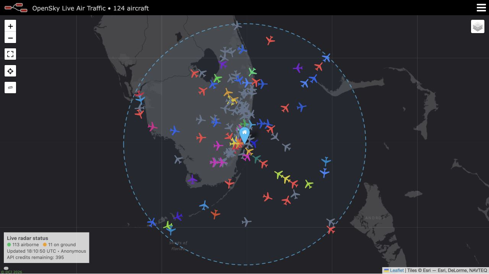

# Node-RED Live Flight Radar — OpenSky with Optional AirLabs Routes

A ready-to-import Node-RED flow that plots nearby OpenSky aircraft on an interactive world map and can optionally add AirLabs routes, flight status, and airport schedules.



**Jump to:** [Quick start](#quick-start--radar-only) · [OpenSky authentication](#optional-authenticated-opensky-mode) · [AirLabs setup](#airlabs-credential-setup) · [Node-RED verification](#first-deployment-verification--node-red-editor) · [Troubleshooting](#troubleshooting)

## Data sources and responsibilities

The flow combines four complementary sources. Each one has a separate job:

- **OpenSky Network — live positions:** supplies aircraft coordinates, altitude, speed, heading, callsign, and on-ground status. OpenSky is the only source that creates and updates map markers.
- **AirLabs — routes and schedules:** optionally adds public flight numbers, departure and arrival airports, flight status, airport timetables, delays, terminals, gates, and baggage information when available.
- **FAA — operator information:** supplies the official company, telephony, and ICAO three-letter-designator directory used to identify airline and aviation operators.
- **OurAirports — airport reference data:** supplies public airport names, IATA/ICAO codes, coordinates, and scheduled-service classifications so the nearest relevant airport can follow the radar location.

These sources complement one another. AirLabs, FAA, and OurAirports enrich the display, but none of them replaces OpenSky's live aircraft positions. If an enrichment source is unavailable, the OpenSky radar continues operating.

The flow code is open source under the [MIT License](LICENSE). The data sources have their own terms: OurAirports publishes its downloadable files as public domain, while OpenSky data, FAA publications, and AirLabs services remain subject to their respective provider terms. AirLabs is an optional commercial API and requires a private key; using this MIT-licensed flow does not make AirLabs data open source.

## What it does

- Shows live aircraft inside a configurable circular search area
- Rotates aircraft icons to their reported direction of travel
- Groups airborne aircraft, rotorcraft, ground traffic, and radar coverage into separate layers
- Displays a cleaner flight card with operator, altitude, speed, distance, category, and last-contact age
- Refreshes the official FAA company, telephony, and ICAO three-letter-designator directory once per day
- Keeps an embedded operator list available if the FAA directory cannot be reached or parsed
- Uses the public-domain OurAirports directory to select the nearest scheduled-service airport inside the radar radius
- Optionally matches visible aircraft to AirLabs live flights by aircraft hex, adding routes such as **MIA → MCO** and current status
- Keeps a separate AirLabs timetable cache for the nearest airport, adding scheduled times, delays, terminals, gates, and baggage when available
- Keeps live tracking independent, so missing credentials or a schedule-provider outage cannot stop the radar
- Shows live aircraft count, refresh time, authentication mode, and remaining API credits
- Keeps aircraft visible between updates and removes stale markers after a seven-minute grace period
- Reports a credential-free health summary every five minutes and sends failures to a separate errors-only Debug node
- Uses anonymous access by default, with optional OAuth credentials read from environment variables

## Requirements

- [Node-RED](https://nodered.org/)
- [`node-red-contrib-web-worldmap`](https://flows.nodered.org/node/node-red-contrib-web-worldmap) 5.8.1 or newer
- Outbound HTTPS access to `opensky-network.org` and, when OAuth is enabled, `auth.opensky-network.org`
- Outbound HTTPS access to `www.faa.gov` for the optional daily operator-directory refresh
- Outbound HTTPS access to `davidmegginson.github.io` for the weekly public airport-directory refresh
- Optional outbound HTTPS access to `airlabs.co` for live route and airport-schedule enrichment

The flow export declares the required worldmap package, but you can also install it from **Menu → Manage palette → Install**.

## Quick start — radar only

1. Download [`OpenSky-Planes-WorldMap.json`](OpenSky-Planes-WorldMap.json).
2. In Node-RED, choose **Menu → Import → Clipboard** and import the file.
3. Open **Prepare location, auth & request** and edit the three defaults at the top:

   ```js
   const defaultCenterLat = 25.7617;
   const defaultCenterLon = -80.1918;
   const defaultRadiusKm = 150;
   ```

4. Click **Done**, then **Deploy**.
5. Click the small button on the left of **Poll every 5 min (anonymous-safe default)** once.
6. Open `http://<your-node-red-host>:1880/worldmapplanes`.

The map automatically fits the selected radar area whenever a viewer connects. This basic setup requires no API key. Continue below only if you want authenticated OpenSky access or AirLabs routes and schedules.

### Names and URLs

- **Display title:** Node-RED Live Flight Radar — OpenSky with Optional AirLabs Routes
- **GitHub repository:** `TheDyslexicCoder/node-red-live-flight-radar`
- **Map URL:** keep `/worldmapplanes`; existing bookmarks and Node-RED links continue to work.

The title describes the new capability without implying that AirLabs is required. OpenSky remains the live position source and the radar continues working when AirLabs is disabled.

## API access and safe credential handling

### Anonymous mode — default

No API key is required for the included setup. OpenSky currently allows anonymous requests to `/api/states/all`, subject to a smaller daily credit allowance. The flow therefore polls every **5 minutes** instead of every 30 seconds.

At the included Miami location and 150 km radius, the bounding box is under 25 square degrees and normally costs one API credit per update. Larger areas can cost more. See OpenSky's current [REST API limits and credit rules](https://openskynetwork.github.io/opensky-api/rest.html#limitations) before increasing the radius or polling frequency.

### Changing the OpenSky polling interval in Node-RED

The default is five minutes. The Inject node controls the real request schedule; `pollSeconds` keeps marker expiry and Debug information aligned with that schedule.

If your flow tab shows **Environment Variables**:

1. Double-click the **OpenSky + AirLabs Live Flight Radar** flow tab.
2. Open **Environment Variables**, click **Add**, name it `OPENSKY_POLL_SECONDS`, and enter the desired number of seconds (`300` is the default when it is absent).
3. Double-click the **Poll every 5 min (anonymous-safe default)** Inject node.
4. Set **Repeat → interval** to the same value, click **Done**, optionally rename the node, and **Deploy**.

If your Node-RED editor does not show **Environment Variables**, open **Prepare location, auth & request**, find this line near the top, and change `300` to the same number of seconds used by the Inject node:

```javascript
const defaultPollSeconds = 300;
```

Use the same value in both places. Leave both at five minutes while first testing credentials.

For the included 150 km Miami bounding box, each poll normally costs one `/states/all` credit:

| Interval | Polls per day | Practical OpenSky tier |
|---|---:|---|
| 5 minutes | 288 | Anonymous-safe under the documented 400-credit daily allowance |
| 1 minute | 1,440 | Requires an authenticated Standard account or higher |
| 20 seconds | 4,320 | Exceeds Standard's 4,000 daily credits; use an eligible higher tier or your own receiver data |

Anonymous state vectors have 10-second time resolution and authenticated state vectors have 5-second resolution. Twenty-second polling can therefore return newer positions, but it is not sustainable on the Anonymous or Standard daily allowance. A `429 Too Many Requests` response means the current bucket is exhausted; restore a slower interval and wait for the provider's retry window.

### Optional authenticated OpenSky mode

For a larger allowance, create an API client in your OpenSky account. OpenSky provides a JSON object containing both values, for example:

```json
{"clientId":"example-api-client","clientSecret":"example-secret"}
```

Both values are required. A Client ID by itself cannot authenticate.

#### Method A — Environment Variables, when visible

Double-click the **OpenSky + AirLabs Live Flight Radar** flow tab, open **Environment Variables**, and add:

```text
OPENSKY_CLIENT_ID=replace_with_your_client_id
OPENSKY_CLIENT_SECRET=replace_with_your_client_secret
```

#### Method B — private Raspberry Pi editor fallback

Use this only when your Node-RED editor does not show flow-level Environment Variables:

1. Double-click **Prepare location, auth & request**.
2. Find these exact lines, currently around Function lines 70–71:

   ```javascript
   const clientId = env.get("OPENSKY_CLIENT_ID");
   const clientSecret = env.get("OPENSKY_CLIENT_SECRET");
   ```

3. Replace them with exactly one declaration for each value:

   ```javascript
   const clientId = "PASTE_ONLY_YOUR_CLIENT_ID_HERE";
   const clientSecret = "PASTE_ONLY_YOUR_CLIENT_SECRET_HERE";
   ```

4. Paste only the two values from the OpenSky JSON—not the braces, property names, or commas.
5. Click **Done**, **Deploy**, and then **Poll every 5 min**.

The node should briefly show `refreshing OAuth token`, followed by `authenticated`. The health Debug should change `radar.authMode` from `Anonymous` to `Authenticated` and report the live OpenSky credit balance.

Operating-system, service, and Docker environment variables remain supported for share-safe deployments. The flow automatically:

1. Requests an OAuth2 client-credentials token.
2. Caches the short-lived access token in flow context.
3. Refreshes it shortly before expiration.
4. Falls back to anonymous access if optional authentication fails.

Environment Variables are the preferred share-safe method. The Function fallback is for a private local Node-RED installation only. Never export, commit, upload, or screenshot a flow while either credential is hard-coded. Restore the original `env.get(...)` lines before publishing an export.

OpenSky no longer accepts basic username/password authentication. OAuth2 client credentials are the supported authenticated method; see the official [authentication instructions](https://openskynetwork.github.io/opensky-api/rest.html#authentication).

## Live routes and location-aware airport schedules

The radar is not hardcoded to Miami. It downloads the public-domain [OurAirports data](https://ourairports.com/data/) once per week, keeps only scheduled-service airports with IATA codes, and selects the nearest one inside the current OpenSky radius. A Miami center normally selects a Miami-area airport; Chicago and San Francisco centers make their own selections from the same coordinates.

The radar works without OurAirports or AirLabs. OurAirports needs no API key. When AirLabs enrichment is enabled, two complementary caches are used:

1. One [Real-Time Flights](https://airlabs.co/docs/flights) request covers the current radar bounding box. It returns aircraft hex identifiers, published flight numbers, origin, destination, and status. The flow matches the AirLabs `hex` to OpenSky's ICAO24 identifier first, which is much more reliable than matching a timetable row by callsign alone.
2. One departure-board and one arrival-board [Schedules](https://airlabs.co/docs/schedules) request cover the selected airport. These rows can add scheduled or estimated times, delay, terminal, gate, and baggage details.

OpenSky remains the source for every map position and for the exact 150 km circular boundary. The AirLabs live request uses a box around that circle only to build a route lookup. Records in the box corners cannot create map markers, because an aircraft must first be present in OpenSky's exact circle.

### AirLabs credential setup

Create or activate an [AirLabs](https://airlabs.co/) account. No terminal is required.

#### Method A — Environment Variables, when visible

1. In the Node-RED editor, double-click the **OpenSky + AirLabs Live Flight Radar** flow tab at the top of the workspace.
2. Open the **Environment Variables** section and click **Add**.
3. Enter `AIRLABS_API_KEY` as the name and paste the private key into its value field.
4. Do not add `AIRLABS_AIRPORT_IATA` for automatic airport selection. To pin one airport, add it as a second variable with a three-character IATA value.
5. Click **Done**, then **Deploy**.
6. Click the Inject button beside **Check live routes every minute (2 hr guard)** once.
7. Click the Inject button beside **Check whether selected airport needs refresh** once.
8. Open **AirLabs live routes + schedules (safe)** in the Debug sidebar. A working configuration shows live-route records, a selected airport, schedule records, and safe request-usage information.

Both AirLabs Function nodes read the same variable:

```javascript
const apiKey = env.get("AIRLABS_API_KEY");
```

#### Method B — private Raspberry Pi editor fallback

Use this only when your Node-RED editor does not show flow-level Environment Variables:

1. Open **Prepare safe live-route request**.
2. Find this exact line, currently at Function line 73:

   ```javascript
   const apiKey = env.get("AIRLABS_API_KEY");
   ```

3. Replace it with:

   ```javascript
   const apiKey = "PASTE_YOUR_AIRLABS_KEY_HERE";
   ```

4. Click **Done**.
5. Open **Prepare safe schedule requests** and find the same `env.get("AIRLABS_API_KEY")` declaration, currently around Function line 91.
6. Paste the identical `const apiKey = "...";` line from the first Function. Copy the entire line instead of typing the key twice; this prevents the live-route and schedule nodes from using different keys.
7. Click **Done**, then **Deploy**.

For deployments managed outside the Node-RED editor, the same variable can instead be supplied to the Node-RED process:

```text
AIRLABS_API_KEY=replace_with_a_new_private_key
```

Leave `AIRLABS_AIRPORT_IATA` unset for automatic location-aware selection. To deliberately pin a particular airport, add an optional three-character code such as `AIRLABS_AIRPORT_IATA=MIA`.

Three optional flow-tab Environment Variables make the integration adaptable:

- `AIRLABS_LIVE_REFRESH_MINUTES` changes the live-route interval from its 120-minute default. Accepted values are 1 to 1,440 minutes; the one-minute Inject node only checks the guard and does not call AirLabs before the interval is due.
- `AIRLABS_SCHEDULE_REFRESH_MINUTES` changes the selected-airport timetable interval from its 360-minute default. Accepted values are 15 to 1,440 minutes.
- `AIRLABS_MONTHLY_REQUEST_CAP` changes the local rolling 30-day safety stop from its default of 750 attempted requests. Keep this below the allowance shown in the AirLabs account dashboard so testing, prior dashboard usage, restarts, and redeployments have a buffer.

Environment Variables are preferred. The Function fallback is local-only: never export or publish the edited flow with the key present. Restore both original `env.get("AIRLABS_API_KEY")` lines first. Treat any key shared in a chat, issue, screenshot, export, or commit as exposed and replace it before publication.

If your Raspberry Pi editor has no Environment Variables, you do not need to edit the refresh settings: the imported Function nodes already contain the protected defaults on Function line 2—`120` minutes in **Prepare safe live-route request** and `360` minutes in **Prepare safe schedule requests**. The API key lines remain separate from those timing defaults.

The included defaults are designed for an AirLabs account showing approximately 1,000 requests per billing cycle. They are independent of the OpenSky polling interval:

- Live-route lookup: one AirLabs request every two hours, or about **360 requests per 30 days**.
- Selected-airport timetable: two AirLabs requests every six hours, or about **240 requests per 30 days**.
- Combined default: about **600 AirLabs requests per 30 days**, regardless of whether 5 or 50 aircraft are visible.
- Local safety guard: 750 attempted requests in any rolling 30-day window, leaving approximately 250 requests of a 1,000-request allowance for prior dashboard usage, setup, testing, failures, restarts, and redeployments.
- Authoritative limit: the allowance and usage shown in the AirLabs account dashboard always take priority. Provider plans can differ, and the local counter cannot see requests made by other applications or before this flow started.
- Schedule storage: at most 50 departures and 50 arrivals, even if the provider returns a larger page.
- Cache behavior: successful live-route data is reused between two-hour refreshes and can remain as clearly labeled stale data for up to six hours after a failure. Selected-airport schedules can remain as labeled stale data for up to 24 hours.
- Storage: caches and the local rolling counter use Node-RED flow context. They do not survive a Node-RED restart unless persistent context storage is configured, so the AirLabs dashboard remains the final source of truth.

The slower AirLabs intervals do **not** slow the moving map. OpenSky still refreshes aircraft positions every five minutes. AirLabs only enriches those markers with cached route and timetable information. A newly appearing aircraft may therefore wait until the next AirLabs route refresh before its origin and destination become available.

AirLabs documents `bbox`, `hex`, flight identifiers, departure/arrival codes, status, and field selection for Real-Time Flights. It documents a maximum 50 schedule records for Free keys and a schedule horizon of up to 10 hours. During the August 31, 2026 live MIA validation, the v9 schedules endpoint accepted `limit=50` but returned a 100-row provider page with pagination metadata. The flow therefore treats the query limit as a request hint and independently slices each schedule direction to 50 before caching. Fields can still be missing or plan-dependent, so the popup omits unavailable values instead of inventing them. Confirm the current [AirLabs introduction and errors](https://airlabs.co/docs/), [Real-Time Flights](https://airlabs.co/docs/flights), [Schedules](https://airlabs.co/docs/schedules), and [terms](https://airlabs.co/terms-of-service), plus the limits shown in your account dashboard, before changing refresh intervals or the rolling cap.

Any visible scheduled flight can receive a route when AirLabs returns the same aircraft hex, including pass-through traffic and flights using another nearby airport. Only flights connected to the selected airport can receive that airport's detailed timetable fields. Private aircraft and provider records without a published route show **Route: Not available from AirLabs** instead of a guessed origin or destination. Automatic airport selection never chooses an airport outside the configured radar radius.

The world-map URL remains `http://<your-node-red-host>:1880/worldmapplanes`; moving the center does not require a new URL or a separate flow.

### How the three update clocks work

1. **OpenSky positions:** every five minutes by default. Only current aircraft inside the exact circle become or refresh markers.
2. **AirLabs live routes:** every two hours by default. One bounding-box response is minimized, cached, and indexed by aircraft hex and flight number; it does not replace OpenSky coordinates.
3. **AirLabs selected-airport schedules:** every six hours. Two responses provide the nearest airport's timetable details and are cached between refreshes.
4. **Marker enrichment:** on each OpenSky update, the resolver first tries the AirLabs aircraft-hex index, then ICAO/IATA flight numbers, then the selected-airport schedule index. A matching route appears as `MIA → MCO`, `MCO → MIA`, or the route AirLabs actually returned.
5. **Location changes:** changing the radar center or radius clears the old live-route cache and permits one immediate AirLabs refresh for the new area. Miami enrichment is therefore never reused after moving the radar to Chicago or San Francisco.
6. **Expiry:** neither AirLabs cache creates or preserves an aircraft marker. When the next OpenSky result no longer contains the plane, its marker expires normally.

### First-deployment verification — Node-RED editor

After configuring the credentials with either method:

1. Click **Deploy**.
2. Click **Poll every 5 min**.
3. Click **Check live routes every minute (2 hr guard)**.
4. Click **Check whether selected airport needs refresh**.
5. Wait about 10 seconds, then click **Poll every 5 min** once more so the newest route cache is applied to map popups.
6. Click **Report safe health every 5 min** and **Report safe AirLabs status every 5 min** to request immediate Debug messages.

A successful setup shows:

```text
radar.authMode: "Authenticated"
liveRoutes.enabled: true
liveRoutes.records: greater than 0
liveRoutes.lastErrorCode: null
schedules.enabled: true
schedules.records: greater than 0 at an active major airport
```

Open a commercial-aircraft marker and look for **Public flight**, **Route**, **Flight status**, and **Route source**. Some private, blocked, newly visible, or unmatched aircraft will correctly show that no AirLabs route is available.

### Optional developer smoke tests

To verify the active key and current account entitlement before deploying, run the opt-in smoke test from this repository:

```bash
AIRLABS_TEST_AIRPORT=MIA npm run test:airlabs
```

Set `AIRLABS_API_KEY` in the terminal environment first; do not paste the key into the command, repository, or script. The smoke test uses exactly two AirLabs requests—one departure and one arrival request—and prints only the airport, provider and retained counts, safe pagination totals, and returned field names. It never prints the key, request URL, flight rows, or provider request metadata that could contain credential information.

Developers can verify live route matching with exactly one AirLabs request and one anonymous OpenSky request:

```bash
npm run test:airlabs:live
```

That test prints only safe counts, returned field names, provider credits remaining, and how many current OpenSky aircraft matched an AirLabs aircraft hex and route. It never prints a flight row, request URL, or key. Normal Raspberry Pi users can perform the same verification from the Node-RED Debug sidebar without a terminal.

In the August 31, 2026 UTC Miami validation, one AirLabs live request returned 60 records; 39 of 47 OpenSky aircraft inside the exact 150 km circle matched by aircraft hex, and all 39 matches included origin and destination. This is a snapshot, not a guaranteed coverage rate: provider coverage and the aircraft visible at any later moment will differ.

In the **System health (safe, every 5 min)** Debug output, confirm:

- `airports.selectedIata` is the expected airport and `distanceKm` is within the radius.
- `liveRoutes.enabled` and `liveRoutes.ready` are `true`, `records` is greater than zero, and `updatedAt` is populated.
- `schedules.enabled` and `schedules.ready` are `true`.
- `schedules.updatedAt` is populated and `schedules.records` is greater than zero for an active major-airport board.
- `airlabsUsage.requestsUsed` increases by one for each attempted live-route refresh and two for each attempted timetable refresh. Failed attempts are counted conservatively because they may still consume provider capacity.
- `airlabsUsage.estimated30DayRequests` should show approximately `600`, `monthlyRequestCap` should show `750`, and `requestsRemainingInLocalBudget` shows the remaining local buffer.
- `schedules.partialFailure: true` means either the arrival or departure board failed while the other board succeeded. Check `lastErrorDirection`; the flow preserves this warning instead of allowing the successful response to hide it.
- `providerCreditsRemaining` is populated only when AirLabs sends the header. The AirLabs account dashboard is authoritative and may show more usage than Node-RED because it includes earlier tests and other applications.

The general health message appears automatically after startup and every five minutes. You can also click **Report safe health every 5 min** to check immediately. **AirLabs live routes + schedules (safe)** separates live-route, timetable, and usage diagnostics. If AirLabs rejects a request, **Errors only (empty is healthy)** reports a sanitized code such as `unknown_api_key`, `wrong_params`, or `month_limit_exceeded`; none of these outputs prints the key or request URL.

## Runtime overrides

For automation, set either `flow.openskyRadarOverride`, `global.openskyRadarOverride`, `msg.config`, or direct message properties:

```json
{
  "centerLat": 40.7128,
  "centerLon": -74.006,
  "radiusKm": 150
}
```

Message values have the highest priority. Accepted ranges are:

- Latitude: `-90` to `90`
- Longitude: `-180` to `180`
- Radius: `1` to `500` km

The final validated values are available at `flow.openskyRadarConfig`. Keeping overrides separate from the effective config means changing the three defaults still works after redeploying.

Optional schedule settings can be overridden with `global.openskyScheduleOverride`, `flow.openskyScheduleOverride`, or `msg.scheduleConfig`:

```json
{
  "airportIata": "",
  "refreshMinutes": 360,
  "maxRecords": 50,
  "monthlyRequestCap": 750
}
```

An empty `airportIata` uses the nearest scheduled-service airport inside the current circle. Set a three-character IATA code only when you intentionally want a manual override. Accepted schedule ranges are 15 to 1,440 minutes and 1 to 50 records per direction. Reducing the interval can exceed a free API quota quickly.

Optional live-route settings can be overridden with `global.openskyAirLabsLiveOverride`, `flow.openskyAirLabsLiveOverride`, `msg.airlabsLiveConfig`, or the flow-tab variables described above:

```json
{
  "refreshMinutes": 120,
  "monthlyRequestCap": 750
}
```

The shared request ledger is stored in `flow.airlabsRequestUsage`. Each attempted request is retained for 30 days and then ages out of the rolling window. The effective radar, live-route, airport, and schedule values are available in `flow.openskyRadarConfig`, `flow.openskyAirLabsLiveConfig`, `flow.airlabsLiveCache`, `flow.airlabsLiveMeta`, `flow.openskyScheduleConfig`, `flow.airlabsScheduleCache`, and `flow.airlabsScheduleMeta`. The minimized public airport list and refresh metadata are in `flow.ourAirportsDirectory` and `flow.ourAirportsMeta`. No API key or credential-bearing request URL is stored in those values.

## Visual improvements

The updated flow uses a dark-gray basemap, smaller heading-aware aircraft icons, a dashed search-radius overlay, a persistent radar-center marker, hover tooltips, and a compact status legend. Speed remains in the popup but is no longer sent as a worldmap vector, which removes the long red leader lines that made the original map look crowded.

Aircraft returned in the bounding-box corners are filtered out when they fall outside the selected circular radius. Surface vehicles and fixed obstacles are also excluded.

## Debug output

An empty **Errors only (empty is healthy)** Debug node means no handled failure has occurred. It was intentionally quiet in earlier versions, which could make a working flow look inactive.

The separate **System health (safe, every 5 min)** Debug node confirms routine activity. It reports the radar center and radius, aircraft count, OpenSky authentication mode, live credits remaining, estimated cost per poll, polling interval, directory refresh counts, AirLabs live-route and schedule-cache status, the selected airport, rolling 30-day AirLabs usage, the 750-request local cap, remaining local budget, partial schedule failures, and the provider's remaining credits when available. It never includes OAuth credentials, API keys, authorization headers, or request URLs.

The dedicated **AirLabs live routes + schedules (safe)** Debug node separates live-route diagnostics, selected-airport timetable diagnostics, and rolling usage. It includes cached row and match-key counts, cache ages, refresh intervals, estimated 30-day usage, remaining local budget, the quota guard, and sanitized errors. Click **Report safe AirLabs status every 5 min** to request this report immediately. The reporting Inject node itself does not call AirLabs.

## Troubleshooting

| What you see | Meaning | What to do |
|---|---|---|
| Map loads but has no aircraft | There may be no recent OpenSky positions in the selected circle | Increase the radius moderately and check the Debug sidebar |
| HTTP 401 | The OAuth access token was rejected or expired | The flow clears it and requests a new token on the next poll |
| HTTP 429 | The current API credit bucket is exhausted | Wait for the refill time shown by OpenSky; do not shorten the poll interval |
| OAuth warning or `Anonymous` after deployment | One or both OpenSky values are missing, invalid, or were pasted in the wrong form | Confirm there is exactly one `const clientId` and one `const clientSecret`; paste only their values, deploy, and click the OpenSky Inject node |
| Connection problem dialog | Node-RED could not reach OpenSky | Check DNS, firewall, proxy, and outbound HTTPS from the Node-RED host |
| Map opens at the wrong place | The flow was not redeployed or another override is active | Check the effective `flow.openskyRadarConfig` value |
| Waiting for airport directory | The weekly OurAirports download has not completed yet | Confirm outbound HTTPS access to `davidmegginson.github.io`; cached data is reused when available |
| No scheduled airport in radar radius | No scheduled-service airport with an IATA code is inside the selected circle | Increase the radius moderately or deliberately set `AIRLABS_AIRPORT_IATA` |
| AirLabs live routes disabled or AirLabs disabled • airport selected | The Function nodes cannot read the key | Use Method A when Environment Variables are visible, or apply the private Raspberry Pi fallback to both named AirLabs Functions; deploy and click both AirLabs Inject nodes |
| `unknown_api_key` for live routes but schedules work | The two local AirLabs Function lines do not contain the identical key | Copy the entire working `const apiKey = "...";` line from **Prepare safe schedule requests** into **Prepare safe live-route request**, deploy, and click the live-route Inject node once |
| Live-route records exist but a plane has no route | AirLabs did not return that aircraft hex or a complete published route | This is expected for some private, blocked, incomplete, newly visible, or unmatched records; the popup reports that the route is unavailable and never infers one from heading |
| AirLabs live-route error | The live `/flights` request failed or its response changed | Check `liveRoutes.lastErrorCode` in the safe AirLabs Debug output |
| AirLabs schedule error | The key is inactive, expired, invalid, rate-limited, the parameters were rejected, or the response changed | Check the sanitized `lastErrorCode` in `flow.airlabsScheduleMeta` and the errors-only Debug node |
| AirLabs 30-day request guard reached | The local flow has counted 750 attempted requests in its rolling window | Leave the guard in place; requests age out automatically after 30 days, and the AirLabs dashboard remains authoritative |
| `schedules.partialFailure: true` | One schedule direction succeeded while the other failed | Check `schedules.lastErrorDirection` and the errors-only Debug node; cached data remains available where possible |
| AirLabs dashboard usage is higher than Node-RED | The dashboard also includes earlier tests, other applications, or requests made before the local counter started | Trust the dashboard; keep the two-hour/six-hour defaults and do not repeatedly redeploy or manually click the AirLabs request Inject nodes |
| AirLabs unavailable • cached schedules active | A refresh failed, but the previous minimized response is still within its 24-hour stale window | Live OpenSky tracking continues; check the provider later |
| Route appears but no gate or time | The live aircraft matched, but it is not on the selected airport board or the plan omitted those fields | Route and status can still be valid; terminal and gate enrichment is selected-airport-only |

## Data notes

OpenSky provides state vectors derived from ADS-B and related surveillance sources. Callsigns, positions, categories, and metadata can be missing or delayed. The flow does not provide airline schedules, passenger status, delays, or guaranteed aircraft identity.

The live state-vector response does not include an operator-name field. On startup and once every 24 hours, the flow downloads the FAA's official [Aircraft Company/Telephony/Three-Letter Designator Encode](https://www.faa.gov/air_traffic/publications/atpubs/cnt_html/chap3_section_1.html) table and caches it in `flow.faaOperatorDirectory`. The embedded list is used only while that directory is unavailable. The last successful refresh metadata is available at `flow.faaOperatorDirectoryMeta`.

Registration-style callsigns, such as a U.S. `N` number, are labeled **Private / general aviation** because a registration identifies an aircraft, not necessarily its current operator. Custom corrections can be supplied with a `global.openskyOperatorOverrides` object such as `{ "XYZ": "Example Aviation" }`; these always take priority over the FAA and fallback values.

AirLabs route and schedule information is optional third-party data and may be incomplete, delayed, or unavailable. Scheduled and estimated times shown in the popup are the local times returned for their respective airports. Each popup identifies whether the value came from the live-flight cache or selected-airport timetable and shows the cache age; stale values are explicitly labeled cached.

OurAirports provides airport reference data, not operational schedules. AirLabs complements it with optional route, status, and schedule information; neither provider replaces OpenSky's live state vectors. If either enrichment source fails, OpenSky aircraft tracking continues.

Review OpenSky's [API documentation and terms](https://openskynetwork.github.io/opensky-api/), the FAA source, and the current AirLabs plan terms before using the data beyond a personal or educational project.

## Validation tests

The repository includes dependency-free tests for node wiring, Function-node syntax, OurAirports CSV parsing, Miami/Chicago/San Francisco selection, radius enforcement, disabled-provider behavior, the rolling 30-day request guard, documented AirLabs live-flight and schedule fields, aircraft-hex matching, response headers, error codes, codeshares, correct departure/arrival gates, cache minimization, secret removal, aircraft-marker expiry, health output, and stale-data expiry:

```bash
npm test
```

The tests use fictional live-flight and schedule responses plus a test-only credential string. They never require or contact AirLabs.

`npm run test:airlabs` is separate and opt-in because it contacts AirLabs and consumes two real requests. It requires `AIRLABS_API_KEY` in the environment.

## License

This project is licensed under the [MIT License](LICENSE).
